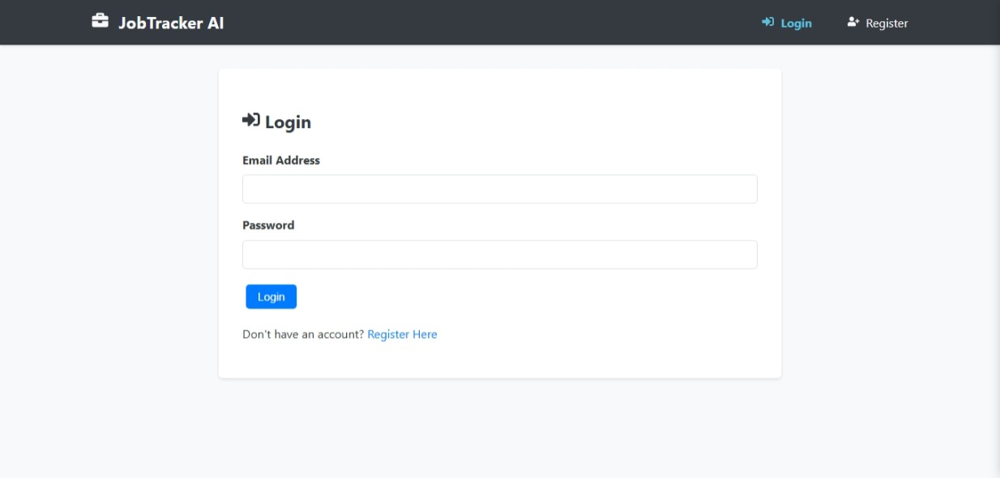
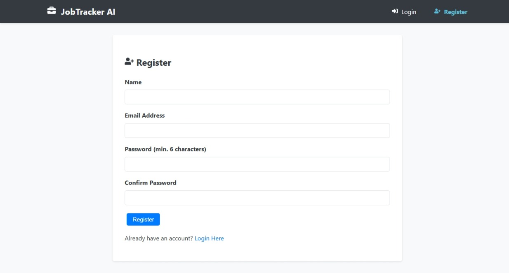
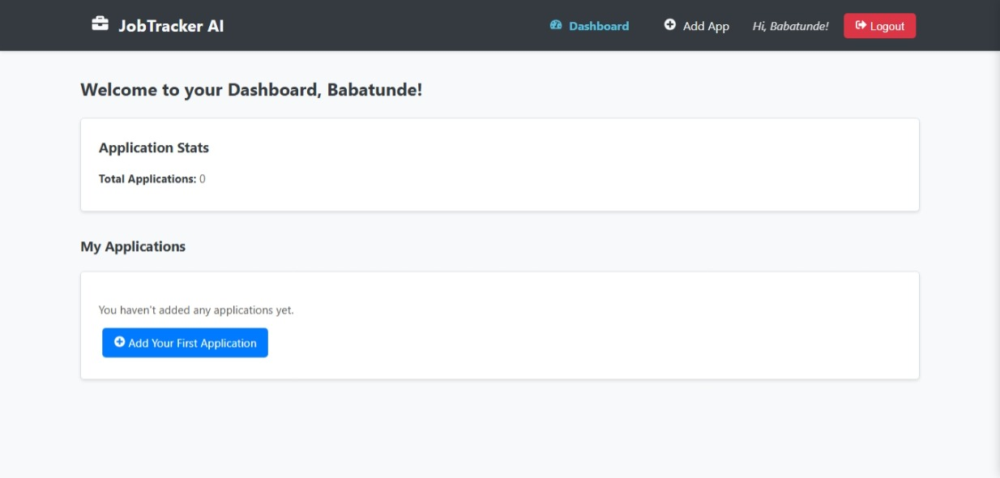
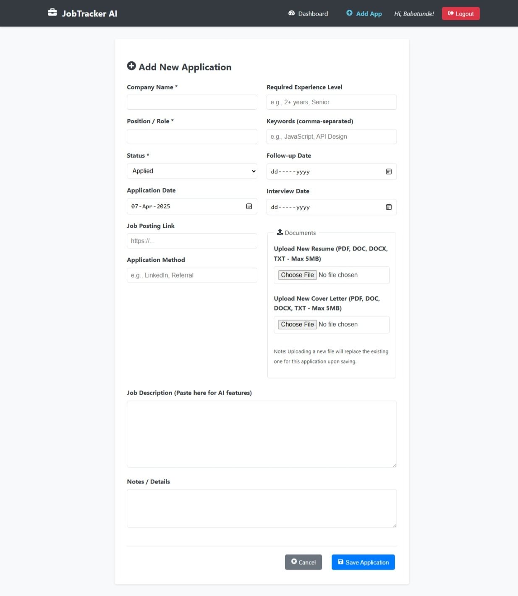

# JobTracker AI - AI-Powered Job Application Tracker

A full-stack web application designed to help job seekers organize their job search, track applications, store documents securely via Cloudinary, and leverage AI-powered insights (OpenAI) to improve their strategy. Built with the MERN stack (MongoDB, Express, React, Node.js) and deployed using free-tier services.

[](https://opensource.org/licenses/MIT)

**Live Demo:** [https://ai-job-tracker-ten.vercel.app/](https://ai-job-tracker-ten.vercel.app/)
**Backend API Hosted On:** Render (Free Tier)

**(Note on AI Features):** The AI assistance features rely on the OpenAI API. Due to using free trial credits or free tier limitations, these features might be temporarily unavailable in the live demo if the usage quota has been exceeded. The integration code itself is functional.*

**(Note on Deployment):** This application is hosted entirely on free service tiers (Vercel, Render, MongoDB Atlas, Cloudinary), which may result in initial loading delays ("cold starts") for the backend API after periods of inactivity.*

---

## Table of Contents

*   [Screenshots](#screenshots)
*   [Features](#features)
*   [Tech Stack](#tech-stack)
*   [Getting Started (Local Development)](#getting-started-local-development)
*   [Deployment](#deployment)
*   [Project Structure](#project-structure)
*   [Challenges Faced & Solutions](#challenges-faced--solutions)
*   [Future Improvements](#future-improvements)
*   [Author](#author)

---

## Screenshots

*(Screenshots included below show the Login, Registration, Dashboard, and Add New Application pages)*

**Login Page**
  

**Registration Page**


**Dashboard Page**


**Add Application Page**



---

## Features

*   **User Authentication:** Secure registration and login using JWT and password hashing (bcryptjs).
*   **Application Tracking:** Add, view, edit, and delete job applications (Company, Position, Date, Status, Notes, Links, etc.).
*   **Dashboard:** At-a-glance view of application statistics and a sortable list of all applications.
*   **Cloudinary File Storage:** Securely upload and manage resumes and cover letters via Cloudinary; files persist reliably.
*   **Reminders:** Input fields for follow-up and interview dates, highlighted on the dashboard.
*   **AI-Powered Insights (OpenAI Integration):**
    *   Generate draft cover letters based on job descriptions.
    *   Analyze application fit against job descriptions and suggest improvements.
    *   Suggest personalized follow-up strategies based on application status.
    *   *(Note: Subject to OpenAI API quota limitations in the live demo).*
*   **Responsive Design:** Basic responsiveness for usability on various screen sizes.

---

## Tech Stack

*   **Frontend:** React (with Vite), React Router, Axios, `react-icons`, `he` (for HTML entity decoding)
*   **Backend:** Node.js, Express.js
*   **Database:** MongoDB (via MongoDB Atlas Free Tier)
*   **ODM:** Mongoose
*   **Authentication:** JWT (JSON Web Tokens), bcryptjs
*   **File Uploads:** Multer, **Cloudinary** (Cloud Storage & SDK - Free Tier)
*   **AI:** OpenAI API (`gpt-3.5-turbo` or similar)
*   **Deployment:**
    *   Frontend: **Vercel** (Free Hobby Plan)
    *   Backend API: **Render** (Free Web Service Tier)

---

## Getting Started (Local Development)

### Prerequisites

*   Node.js (v18.x or later recommended)
*   npm or yarn
*   Git
*   **MongoDB Atlas Account:** Free tier sufficient. Get your connection string.
*   **OpenAI API Key:** Obtain from [OpenAI Platform](https://platform.openai.com/api-keys). Free trial credits available initially.
*   **Cloudinary Account:** Free tier available. Get your `Cloud Name`, `API Key`, and `API Secret`.

### Installation & Setup

1.  **Clone the repository:**
    ```bash
    git clone https://github.com/Garbii1/ai-job-tracker.git
    cd ai-job-tracker
    ```

2.  **Backend Setup (`server` directory):**
    ```bash
    cd server
    npm install
    ```
    *   Create a `.env` file in the `server` directory (`server/.env`). **Do NOT commit this file.**
    *   Add the following environment variables, replacing placeholders with your actual credentials:
        ```dotenv
        # MongoDB Atlas Connection String
        MONGO_URI=<Your MongoDB Atlas Connection String>

        # JWT Secret (make this long and random)
        JWT_SECRET=<Your Strong JWT Secret>
        JWT_EXPIRES_IN=1d

        # Server Port (for local dev)
        PORT=5001

        # OpenAI API Key
        OPENAI_API_KEY=sk-<Your OpenAI API Key>

        # Cloudinary Credentials
        CLOUDINARY_CLOUD_NAME=<Your Cloudinary Cloud Name>
        CLOUDINARY_API_KEY=<Your Cloudinary API Key>
        CLOUDINARY_API_SECRET=<Your Cloudinary API Secret>

        # Frontend URL (for local dev CORS)
        CLIENT_URL=http://localhost:5173
        ```
    *   Run the backend server:
        ```bash
        npm run dev
        ```
        The API should be running on `http://localhost:5001`.

3.  **Frontend Setup (`client` directory):**
    *   Open a **new terminal** window/tab.
    ```bash
    cd ../client # Navigate back to root, then into client
    npm install
    ```
    *   Create a `.env.local` file in the `client` directory (`client/.env.local`). **Do NOT commit this file.**
    *   Add the backend API URL for local development:
        ```dotenv
        VITE_API_BASE_URL=http://localhost:5001/api
        ```
    *   Run the frontend development server:
        ```bash
        npm run dev
        ```
        The application should be accessible at `http://localhost:5173`.

---

## Deployment

This application is deployed using free tiers:

*   **Backend API:** Hosted on **Render** ([render.com](https://render.com/)).
    *   Connect GitHub repo.
    *   Set **Root Directory** to `server`.
    *   Build command: `npm install`.
    *   Start command: `npm start`.
    *   Add all backend environment variables (from `server/.env`) to Render's "Environment" settings, including `MONGO_URI`, `JWT_SECRET`, `OPENAI_API_KEY`, `CLOUDINARY_*`, and `NODE_ENV=production`. Set `CLIENT_URL` to the deployed Vercel frontend URL.
*   **Frontend UI:** Hosted on **Vercel** ([vercel.com](https://vercel.com/)).
    *   Connect GitHub repo.
    *   Set **Root Directory** to `client`.
    *   Framework Preset: `Vite`.
    *   Add the `VITE_API_BASE_URL` environment variable in Vercel's settings, pointing to the deployed Render API URL (e.g., `https://your-render-app-name.onrender.com/api`).


---

## Challenges Faced & Solutions

*   **Database Connectivity:** Encountered initial `Authentication failed` and `querySrv EREFUSED` errors connecting to MongoDB Atlas.
    *   **Solution:** Meticulously verified user credentials, reset passwords (using autogenerate & copy), ensured correct IP whitelisting (`0.0.0.0/0`), flushed local DNS cache, and confirmed accurate `MONGO_URI` in environment variables.
*   **Persistent File Storage:** Realized Render's free tier has an ephemeral filesystem, making local uploads unsuitable for production.
    *   **Solution:** Integrated Cloudinary for persistent cloud storage. Configured `multer-storage-cloudinary` on the backend, set `resource_type: "raw"` for correct access to non-image files, stored Cloudinary URLs/Public IDs in the database, and implemented file deletion from Cloudinary when application records are removed.
*   **API Key Security:** Faced GitHub Push Protection blocks due to accidentally committing secrets.
    *   **Solution:** Ensured `.env` files were correctly added to `.gitignore`, removed tracked secrets using `git rm --cached`, amended the commit history (`git commit --amend`) before pushing, revoked the exposed keys, and relied on secure environment variable management on Render.
*   **AI Integration Limits:** Hit OpenAI API quota limits (`429` errors) after exhausting free trial credits.
    *   **Solution:** Added billing to OpenAI account with strict usage limits for continued functionality OR acknowledged the limitation in documentation for the free demo. Implemented error handling in the frontend to display quota-related messages from the backend.
*   **Deployment Configuration:** Required careful setup of Root Directories (`server` for Render, `client` for Vercel) and environment variables (`CLIENT_URL`, `VITE_API_BASE_URL`) for proper communication between the deployed frontend and backend.
    *   **Solution:** Followed platform documentation, set correct Root Directories, configured CORS on the backend via `CLIENT_URL`, and pointed the frontend to the backend API via `VITE_API_BASE_URL`. Debugged `npm start` script issues on Render.
*   **Module/Import Errors:** Encountered `TypeError` and `ReferenceError` due to incorrect `module.exports` / `import` syntax or definition order.
    *   **Solution:** Used `console.log(typeof variable)` for debugging, ensured correct `module.exports = variableName` (not object) for CommonJS requires, verified function/variable definitions occurred before usage, and double-checked file paths.
*   **HTML Entity Display:** Noticed entities like `&` appearing instead of characters like `&`.
    *   **Solution:** Removed `.escape()` from backend validation rules (`express-validator`) for fields intended for plain text display. Alternatively, used the `he` library on the frontend (`he.decode(string)`) for robust decoding before rendering.

---

## Future Improvements

*   **Advanced AI Features:** Implement resume parsing to auto-fill application fields, provide more detailed keyword matching analysis between resume/JD, and potentially predict application success probability.
*   **Enhanced Dashboard:** Add data visualization (charts) for application status breakdown, timelines, or success rates by source. Implement search and filtering for the application list.
*   **Notifications:** Integrate email or SMS reminders for follow-up dates and interviews (e.g., using SendGrid, Twilio - may incur costs).
*   **User Profile:** Allow users to store skills, experience summaries, and multiple resume/cover letter versions to better personalize AI prompts.
*   **Testing:** Implement comprehensive testing (unit tests for controllers/utils, integration tests for API endpoints, end-to-end tests for user flows using tools like Jest, Supertest, Cypress/Playwright).
*   **UI/UX Refinements:** Improve loading states, provide more granular user feedback, potentially adopt a UI component library (like Chakra UI or Material UI) for consistency, enhance responsiveness.
*   **Pagination:** Add pagination to the dashboard application list for better performance with many applications.
*   **Job Board Integration (Complex):** Explore possibilities for automatically importing applications from platforms like LinkedIn or Indeed (requires extensive research into their APIs/scraping techniques).

---

## Author

*   **Muhammed Babatunde Garuba**
*   **GitHub:** [@Garbii1](https://github.com/Garbii1)

---

